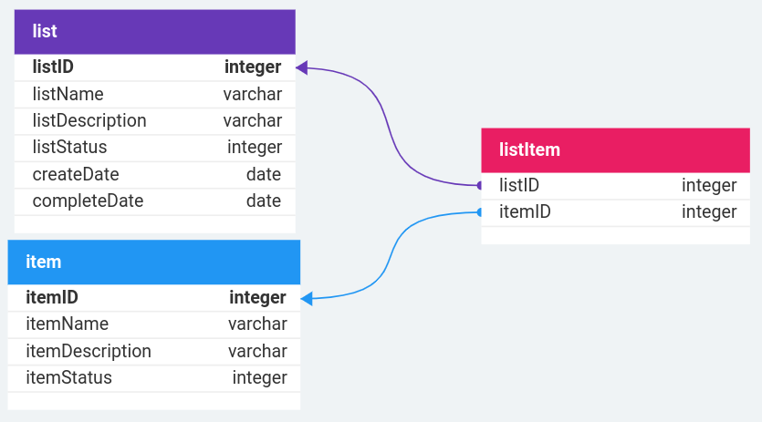

# A simple shopping list application
Front-end consists of JavaScript, HTML and CSS.
It is served by a simple python http server.
```
cd frontend
python3 -m http.server 8000
```

The backend is a REST API using Gin module in Go.
I also use SQLite to store the data.
To get the required modules and subsequently run the server:
```
cd backend
go get .
go run .
```


## Database
